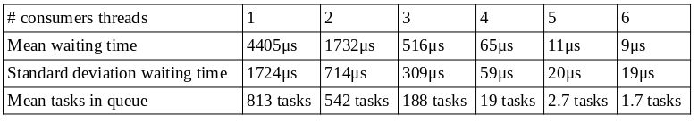

# A solution to the producer consumer problem using	pthreads.
_Programming assignment for the Real Time Embedded Systems course, school of Electrical and Computer Engineering, AUTH._  
_March of 2020_

The demo program [pc.c](pc.c) is modified so that the queue accepts WorkFunction structs:
```C
typedef struct {
	void* (*work)(void*);
	void* arg;
} WorkFunction;
```
Also, there are multiple producer and consumer threads that use the same queue to submit and extract jobs. The goal is to measure efficiency by experimenting with different number of consumer threads.

## How to execute

First clone the repository. To execute an experiment:
```sh
cd prod-cons
make
./prod-cons <producer threads> <consumer threads>
```
To analyze the results from an experiment:
```sh
octave --no-gui
analyze;
```

## Benchmarks

The benchmarks were performed on an Intel(R) Core(TM) i7 CPU 870 @ 2.93GHz, 4CPUs, 8 threads. For each number of consumer threads, there were perfomed 7 benchmarks and the average values were computed.



A full report is available in greek [here](report.pdf).
